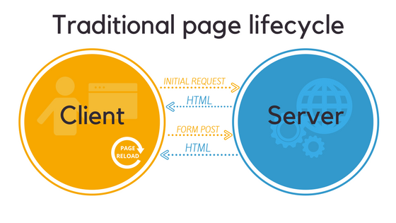
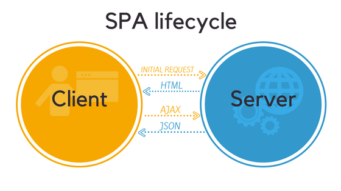

# Single Page Application

| Factor      | Traditional Web App | Single Page Application     |
| :---        |    :----:   |          ---: |
| Required Team Familiarity with JavaScript/TypeScript      | Minimal       | Required   |
| Support Browsers without Scripting   | Supported        | Not Supported      |
| Rich, Complex User Interface Requirements   | Limited        | Well-Suited      |

## Traditional Page Lifecycle

## SPA Page Lifecycle

Reference:
[Optimizing Single Page Application](https://www.mindk.com/blog/optimizing-single-page-applications/)